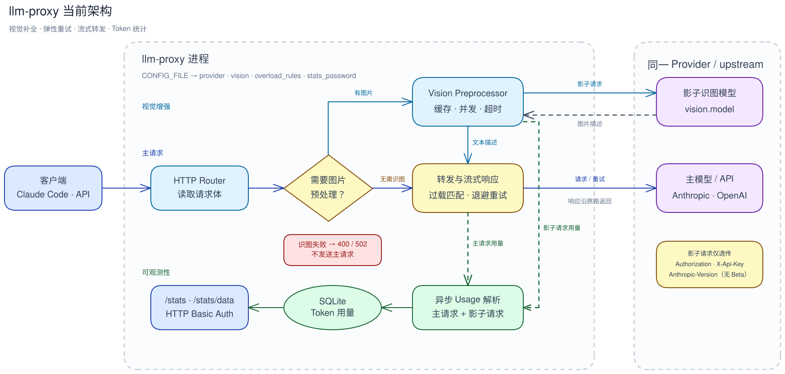

# llm-proxy

面向 Agent 和 LLM SDK 的轻量级多 Profile 代理。

通过 Web 控制台管理上游协议、视觉增强和容错规则；客户端使用简单的
Profile URL 选择运行配置，鉴权信息始终由请求透传，llm-proxy 不管理调用方密钥。

## 核心能力

- 多 Profile：按 URL 选择独立的 Anthropic 或 OpenAI 兼容上游。
- 原子热更新：控制台保存后立即发布新的运行时快照，无需重启。
- 模型能力：每个 Profile 保存精确模型 ID、上下文/输出上限、能力，以及输入、输出和缓存参考价格；支持批量匹配录入和管理员手动更新推荐目录，运行时仍只读取管理员保存的事实。
- 智能路由：客户端发送 `model=auto` 时，以本地规则和轻量分析识别任务，在质量与能力
  达标的候选中选择预计完整成本最低的模型；首轮判断后由 Session 保持连续性，每轮继续检查
  硬约束，低级模型还可在回答前主动申请升级。
-上游节点信任边界：备用端点必须与主上游节点声明相同供应商和凭据范围，并继承 Profile 协议，
  不兼容配置在发布运行时前被拒绝。
- 视觉增强：为 Anthropic Messages 或 OpenAI Responses 中不支持图片的主模型
  补充图片描述。
- 弹性代理：流式转发，并按有序规则处理过载重试。
- 用量与路由统计：记录 Anthropic、OpenAI Chat Completions 和 Responses 的 Token，并
  展示最近 Auto 路由、模型切换、主动升级、预算和费用估算。
- 本地配置生成：浏览器生成 Claude Code、OpenCode 和 Codex CLI 配置，不接收或
  保存真实密钥。

## 快速开始

准备 `.env`：

```sh
cp .env.example .env
```

启动：

```sh
docker compose up -d --build
```

打开 `http://<host>:<port>/_admin/`，使用 `admin/admin` 首次登录，并按页面提示
设置新密码。随后创建 Profile、填写 Upstream，并从 Profile 列表生成 Agent 配置。
完整操作见[管理控制台](docs/admin.md)。

## 架构



## 文档

| 文档 | 内容 |
|---|---|
| [运行配置](docs/configuration.md) | 进程与 Docker Compose 环境变量 |
| [Profiles](docs/profiles.md) | 路由、协议、上游、热更新、视觉和重试 |
| [模型能力与 Agent 上下文](docs/models.md) | Profile 模型事实、UI 推荐与 Claude Code/Codex/OpenCode 映射 |
| [管理控制台](docs/admin.md) | 登录、Profile 操作、配置生成、统计和系统管理 |
| [图片预处理](docs/vision.md) | 图片来源、缓存、并发、失败与日志 |
| [Token 用量统计](docs/statistics.md) | 控制台筛选、统计口径和协议限制 |
| [智能路由](docs/intelligent-routing.md) | 已上线的 `model=auto`、Profile 隔离、质量/成本选型与后续路线图 |
| [Mesotes 智能路由设计站](docs-site/README.md) | 智能路由架构、当前实现状态与后续设计的可浏览版本 |
