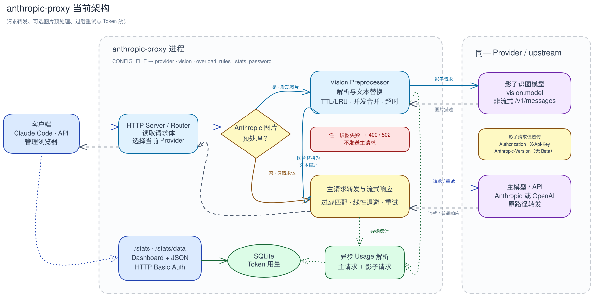

# anthropic-proxy

面向 Claude Code 等客户端的轻量级 Anthropic / OpenAI 反向代理。

项目当前的核心功能是图片预处理：当主模型不支持视觉输入时，代理会先调用同一 Provider 中可识图的模型生成图片描述，再用描述替换图片并提交给主模型。这样可以在不更换主模型的前提下，为纯文本模型补充截图、界面、报错和代码图片的理解能力。

同时提供可配置的过载重试、流式响应转发和 Token 用量统计。

## 核心能力

- **视觉能力补全**：拦截 Anthropic Messages 图片块，通过影子识图请求转换为文本描述；
- **稳定转发**：按状态码和响应内容匹配过载规则，线性退避后自动重试；
- **协议支持**：代理 Anthropic 与 OpenAI 兼容接口；
- **用量统计**：异步记录主请求和识图请求的 Token 用量，提供 Dashboard 与 JSON API。

图片预处理的适用场景、限制和调优方式见[图片预处理](docs/vision.md)。

## 架构



[可编辑的 Excalidraw 源文件](docs/assets/anthropic-proxy-architecture.excalidraw)

## 快速开始

### 1. 准备环境变量

```bash
cp .env.example .env
```

`.env` 只控制 Docker 的宿主机监听地址、端口和配置文件路径：

```bash
HOST=127.0.0.1
PORT=8087
CONFIG_FILE=./config.yaml
```

### 2. 配置 Provider

编辑 `config.yaml`，至少确认当前 Provider、上游地址和识图模型：

```yaml
listen: :8080
active: jdcloud
stats_db: ./data/stats.db
stats_password: statspwd123456

providers:
  jdcloud:
    upstream: https://modelservice.jdcloud.com/coding/anthropic
    vision:
      enabled: true
      model: Kimi-K2.5
    overload_rules:
      - status: 400
        body_contains: overloaded
```

`vision.model` 必须填写上游实际接受的模型名称，不会读取 Claude Code 的 `sonnet`、`haiku`、`opus` 映射。

### 3. 启动

```bash
docker compose up -d --build
```

然后让 Claude Code 使用本地代理：

```bash
export ANTHROPIC_BASE_URL=http://127.0.0.1:8087
```

统计页面默认位于 `http://127.0.0.1:8087/stats`，用户名为 `admin`。默认密码 `statspwd123456` 仅适合本机测试，使用前建议在配置文件中修改。

## 文档

| 文档 | 内容 |
|---|---|
| [图片预处理](docs/vision.md) | 核心原理、启用方式、模型选择、缓存、并发和诊断日志 |
| [配置参考](docs/configuration.md) | 环境变量、配置文件、Provider、协议和重试规则 |
| [Token 用量统计](docs/statistics.md) | 统计口径、接口、Basic Auth 和安全注意事项 |

## 本地开发

需要 Go 1.25+：

```bash
make test
make build
CONFIG_FILE=config.yaml ./bin/anthropic-proxy
```

构建和测试也可以完全在 Docker 中进行，避免修改本地 Go 环境。
