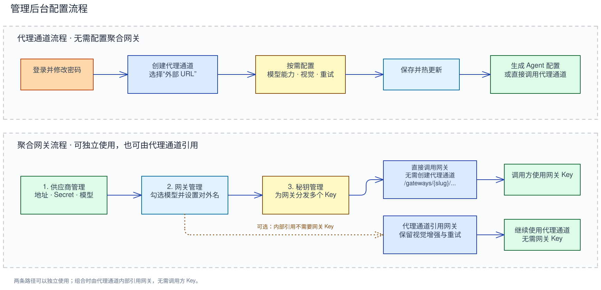

# 管理控制台

管理控制台位于 `/_admin/`，包含代理通道、聚合网关、用量统计和系统设置页面。

## 首次登录

首次启动使用账号 `admin`、密码 `admin` 登录，然后按页面提示设置至少 10 个字符的
新密码。首次密码修改完成后才会加载代理通道与聚合网关运行时；在此之前数据面不可用。

## 选择使用方式

| 使用方式 | 需要配置 | 是否创建代理通道 | 能力 |
|---|---|---|---|
| 只用代理通道 | 代理通道 | 是 | 外部上游代理、视觉增强、有序重试、Agent 配置生成 |
| 只用聚合网关 | 供应商、网关、调用方 Key | 否 | 供应商 Secret 托管、精确模型路由、多个调用方密钥、网关用量统计 |
| 组合使用 | 聚合网关和引用该网关的代理通道 | 是 | 聚合网关路由，加上代理通道的视觉增强、重试和配置生成 |

代理通道和聚合网关都可以独立提供请求入口。只用聚合网关时，不需要创建任何代理通道；
调用方直接使用 `/gateways/{slug}/v1/...` 和网关 Key。

## 只使用代理通道

### 1. 创建代理通道

进入“代理通道”，点击“创建第一个代理通道”或“新建代理通道”：

1. 填写名称和 slug。slug 会成为公开代理 URL 的路径前缀。
2. Upstream 类型选择“外部 URL”；选择后才显示协议和 Upstream 配置。
3. 选择协议并填写 Upstream 基础地址，不要包含调用方密钥。
4. 保存代理通道。第一个代理通道会自动成为默认项，后续保存会立即热更新运行时。

默认代理通道使用 `/v1/...`；指定代理通道使用 `/<slug>/v1/...`。例如 slug 为
`coding` 时，Anthropic Messages 地址为 `/coding/v1/messages`。

### 2. 配置模型与视觉增强（可选）

“模型能力”是选填项。粘贴已收录的模型 ID 会自动填写上下文窗口、最大输出 Token
和视觉能力；保存前可以人工调整。`支持视觉 = 否` 表示该主模型可使用图片增强，
`支持视觉 = 是` 表示图片直接交给主模型。

需要图片增强时：

1. 打开“启用视觉预处理”。
2. 在“识图模型”中填写外部 Upstream 实际支持的视觉模型。
3. 选择未收录模型的处理方式。
4. 如有需要，在“视觉参数”中调整 Token、超时、并发、缓存或提示词。

代理通道的过载规则按页面顺序匹配，命中第一条后按其重试次数和等待参数执行。
更完整的字段说明见[代理通道](profiles.md)和[图片预处理](vision.md)。

### 3. 生成 Agent 配置

在代理通道列表点击“生成配置”：

1. 填写 Agent 能访问到的 llm-proxy 公网地址。
2. 选择页面提供的 Agent。Anthropic 代理通道提供 Claude Code 和 OpenCode；OpenAI
   代理通道提供 Codex CLI 和 OpenCode。
3. 选择全局、项目或命名配置目标，并填写模型映射。
4. 复制或下载生成结果，保存到页面标出的客户端路径。
5. 在 Agent 本地设置真实认证环境变量。

生成器不会保存公网地址、模型映射或密钥。Agent 支持范围和具体输出字段见
[模型能力与 Agent 上下文](models.md)。

## 聚合网关流程

聚合网关可以独立使用，也可以作为代理通道的内部 Upstream。侧栏“聚合网关”下按顺序
提供三个管理入口；三个入口默认均为列表页，新增操作从列表页对应按钮进入：

1. **供应商管理**：点击“新增供应商”，保存协议、Upstream、认证 Header、供应商
   Key / Secret 和一个或多个支持模型。点击已有供应商可编辑；编辑时 Secret 留空会保留
   已保存值。
2. **网关管理**：点击“新建网关”，选择协议并勾选供应商模型；按需修改对外模型名。
   点击已有网关可编辑路由和启停状态。
3. **秘钥管理**：选择网关后创建一个或多个调用方 Key。明文只在创建成功时显示一次，
   必须立即保存；丢失后只能创建新 Key。建议设置过期时间。

供应商、网关或 Key 保存后会立即发布新的运行时快照，不需要重启服务。当前后台不能单独
停用或删除已有调用方 Key；Key 泄露时应先停用整个网关，避免继续使用已泄露凭据。

配置完成后有两种接入方式：

- **只使用聚合网关**：到此即可，不需要创建代理通道。调用方手工配置网关 Base URL，
  使用 `/gateways/{slug}/v1/...` 和网关 Key 直接访问。该入口执行鉴权、精确模型路由和
  可解析的 Token 用量记录，不执行视觉预处理、有序重试或 Agent 配置生成。
- **组合使用**：在代理通道中把 Upstream 类型改为“聚合网关”。选择后才显示网关选择器；
  选中网关会带入协议和启用路由中的模型 ID。内部引用不需要网关 Key，并保留代理通道的
  视觉增强、有序重试和 Agent 配置生成能力。识图模型应填写网关已启用的对外模型名。

字段与调用示例见[聚合网关](aggregate-gateways.md)。

## 日常管理

- “代理通道”支持编辑、复制、启停、设为默认和删除；所有变更保存后立即生效。
- “聚合网关”支持维护供应商、供应商支持模型、对外模型路由和分发给调用方的 Key。
- “用量统计”支持按代理通道、聚合网关、调用方密钥、协议、模型、请求类型和时间筛选，
  并提供每日趋势、网关构成和密钥构成图表。
- “系统设置”支持修改管理员密码、查看运行信息和导出版本化代理通道 JSON。
- 代理通道 JSON 仅用于审阅或迁移代理通道，不包含供应商、网关、调用方密钥、用量或
  供应商 Secret，不能作为完整备份。完整备份必须复制停机后的 SQLite 数据库。

公网部署前还应按[安全边界与部署](configuration.md#安全边界与部署)限制管理后台和未鉴权
代理通道入口。

具体字段说明见[代理通道](profiles.md)、[模型能力](models.md)、
[聚合网关](aggregate-gateways.md)、[图片预处理](vision.md)和
[Token 用量统计](statistics.md)。
