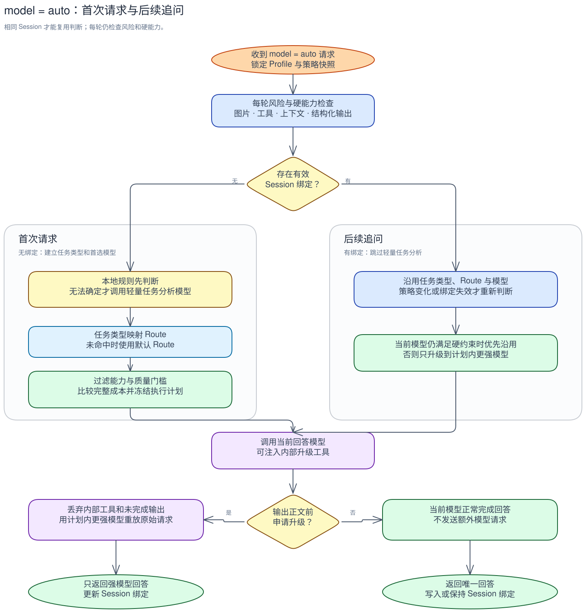
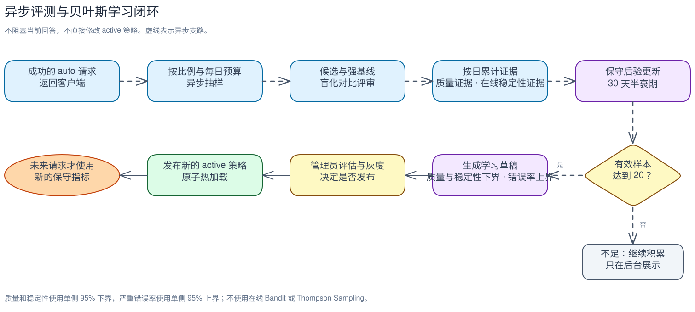

# 智能路由设计

> 状态：Phase 1 智能路由运行时已实现。当前包括首轮任务判断、Session 连续性、每轮硬规则、模型主动升级、
> 视觉增强、重试与上游节点容错、异步对比学习、不可变策略发布，以及完整调用预算和成本核算。

智能路由只在客户端明确发送 `model=auto` 时生效。它先判断任务需要什么能力，再在当前
Profile 中选择满足质量要求且预计总成本最低的模型。客户端指定具体模型时，代理保持原有
行为，不参与选型。

## 一分钟了解

```text
首次请求（没有 Session 绑定）
  → 每轮风险与硬能力检查
  → 明显任务由本地规则判断，拿不准才调用轻量任务分析模型
  → 任务类型映射 Route
  → 先按能力、质量和严重错误率过滤，再选预计完整成本最低的模型
  → 低级模型回答前可通过内部工具申请升级
  → 成功模型写入 Session 绑定

后续追问（携带同一个有效 Session ID）
  → 不再调用轻量任务分析模型
  → 重新检查本轮风险、图片、工具、上下文等硬约束
  → 优先沿用已绑定的任务类型、Route 和模型
  → 当前模型若发现任务明显超出能力，在输出正文前调用内部升级工具
  → 代理丢弃该次未完成输出，用冻结计划中的更强模型重放原始请求
  → 未申请升级时正常回答；升级成功后更新 Session 绑定
```

最重要的边界是：**一次请求只能使用 URL 选中的 Profile**。模型选择、视觉识别、重试、
容错和异步评测都不能跨到其他 Profile。

首轮选中的低级模型同样可以注入升级工具，作为任务分析之后的第二层质量保护。只有调用方持续发送
相同的 `X-LLM-Proxy-Session-ID`，系统才能区分首次请求和后续追问；没有有效 Session 时，每次请求
都按首次请求处理。

贝叶斯更新不在上述在线链路中执行。它位于异步学习支路：抽样比较候选模型与强模型基线，累计
评审证据并计算保守后验区间，达到可靠样本后生成新的策略草稿。只有管理员灰度并发布该草稿后，
新指标才会影响后续在线选模。



## 1. Profile 中需要配置什么

启用智能路由的 Profile 必须配置：

- 至少录入两个不同模型，并选择至少两个参与路由的模型；新录入的模型不会自动加入。
- 一个强模型基线：任务无法可靠判断或没有更合适候选时使用。
- 一个轻量任务分析模型：仅在本地规则无法确定任务时调用。
- 一份 Profile 级高风险策略：只配置明确敏感的当前请求文本片段和实际操作名片段。
- 一份有效策略配置：包含任务类型到 Route 的映射、默认 Route、各 Route 的候选/质量门槛，
  以及在 Route 映射前就能创建的一份统一请求预算。首次保存生成 active 版本，后续修改生成
  独立草稿并经过评估、灰度和人工发布。

以下能力按需配置：

- 开启视觉增强时必须指定视觉模型。
- 开启动态策略优化时必须指定质量评审模型、抽样比例和每日预算。
- 开启模型主动升级时，策略必须允许至少一次模型切换，且所有会承接回答的非强基线候选模型必须明确支持工具调用。
- 重试、上游节点切换和模型切换由策略中的尝试预算统一限制。

缺少对应的必填角色时，配置不能发布。未开启视觉增强或动态策略优化时，不会发起相关的
辅助请求。

## 2. 模型与上游节点

系统把“模型是什么”和“请求发到哪里”分开：

- **ModelCard** 描述模型能力和成本，例如上下文窗口、最大输出、是否支持视觉、输入与输出
  单价。
- **上游节点** 表示当前 Profile 中实际可调用的部署或端点，包括上游地址、可用性和延迟。

缺失数据按保守规则处理：未登记或未确认的能力不视为满足对应硬约束；任何在已启用功能中
可能被调用的模型，如果缺少计算完整成本所需的价格字段，配置或策略不能发布。价格为零是
有效值，字段缺失才表示未知。

当前 Profile 的 Upstream 是 `primary`上游节点，默认支持模型目录中的全部模型。管理员还可按
顺序配置最多 16 个备用上游节点，并为每个备用项声明精确模型列表。只要存在备用项，Profile 主
上游节点和每个备用上游节点都必须填写小写安全标识 `provider_id` 与 `credential_scope`；备用值必须
分别与主上游节点精确一致，缺失、格式错误或不匹配都会在 `Record.Resolve()` 和发布前被拒绝。
这两个值只描述管理员确认的逻辑供应商和凭据适用范围，不是主机名推断结果，也不能填写密钥。

Profile 的 `protocol` 是所有上游节点唯一使用的协议。备用上游节点没有独立协议字段，运行时计划
统一继承 Profile 协议，也不转换请求或凭据。显式模型请求仍只使用 primary，只有 `model=auto`
会把相应模型的 primary 和兼容备用上游节点冻结进执行计划。没有备用上游节点时，两项信任标识
保持可选，现有显式模型透传不受影响。

复合视觉候选只保留同时支持主回答模型和视觉模型的上游节点；备用上游节点只声明回答模型、却未
声明视觉模型时，不能承接这次复合调用。该交集在规划阶段完成，执行时不会临时猜测兼容端点。

## 3. 在线路由

v1 的 `model=auto` 只支持可完整解析的推理操作：Anthropic `POST /v1/messages`，以及 OpenAI
`POST /v1/chat/completions`、`POST /v1/responses`。其他方法或路径使用 `auto` 时返回明确的
unsupported operation 错误；显式模型仍保持现有透传行为，不被 Session 或智能路由改写。

入口路径决定唯一操作，解析器不会根据正文里是否碰巧出现 `messages` 或 `input` 字段来猜协议。
图片、任务文本和实际工具操作都由这份操作感知文档模型读取；协议字段之外的同名嵌套对象不参与
图片计数、能力过滤、风险判断或改写。Responses 的字符串 `input`、easy-message 字符串
`content` 和直接 `input_text` 都用于任务分析与输入 Token 估算。

在线请求按固定顺序处理：

1. URL 先选定唯一 Profile，并加载一次不可变的运行时快照。
2. 协议、安全和请求结构先做入口预检；模型能力、上下文长度等形成后续候选硬约束。
3. 每次请求都执行高风险和硬能力检查。存在有效 Session 绑定时沿用已保存的任务类型、Route、
   最低质量和模型；没有绑定时，本地规则处理明显任务，只有无法确定才调用轻量任务分析模型。
4. 任务类型按已发布策略映射到一个 Route；没有匹配时使用默认 Route。策略变化或绑定失效后重新判断一次。
5. 高风险请求直接使用满足要求的强模型基线；明确的能力要求用于过滤候选。
6. 其余请求在当前 Route 的硬约束和质量门槛内选择预计总成本最低的模型。
7. 系统规划视觉处理、上游节点、重试与切换，并生成不可变的 `ExecutionPlan`。
8. 执行器只能按这份计划工作，不能在执行中临时增加调用。

因此，轻量任务分析负责解决“首次遇到这类任务，应从哪个 Route 开始”，模型主动升级负责解决
“会话继续进行后，当前模型才发现自己做不了”。两者不是每轮都重复调用的两个分类器。

轻量任务分析通过受约束的内部工具返回任务类型、难度、风险和置信度；文本 JSON 仅作为兼容回退。
分析超时、网络故障、过载、畸形输出或置信度不足时，风险记为 `unknown`，并单独标记为“分析回退”，
不会冒充高风险，也不会进入异步评测。只有请求预算和 deadline 仍允许、且当前 Profile 的
强模型基线满足全部硬约束时才会回退；否则请求失败。任务分析遇到 401/403、不可重试 4xx 或重定向/
协议响应属于硬失败，不能回退到强模型基线。
调试日志只记录失败阶段、状态码和响应大小，不包含上游响应正文。

### 高风险任务怎么判断

本地确定性规则只检查**本轮最新用户请求**和**本轮被强制执行的实际操作**：

- `sensitive_text_patterns` 按顺序对规范化的最新用户文本做不区分大小写的子串匹配；
- `sensitive_tool_patterns` 只匹配协议位置中已经调用或按名称强制指定的工具操作；仅在请求中
  声明 `tools` 不会触发高风险，但 `HasTools` 仍是候选模型必须满足的能力约束；
- 结构化输出、长上下文、图片和普通 Shell/Edit 操作只形成能力或容量约束，本身不等于高风险。

敏感片段是管理员提供的普通子串，不执行正则；列表限制长度、要求去除首尾空白且不允许忽略
大小写后的重复项。缺失策略使用内置的窄范围生产变更、凭据轮换、支付和数据库写入规则。
仍不明确时才采用轻量分析模型的高置信结论。命中任一规则后
只使用满足全部硬约束的强模型基线；强基线不满足时明确失败。

会话历史中的 `shell_exec`、`edit` 或旧工具调用只作为任务上下文，不会让后续普通追问自动升级。
如果当前请求明确强制执行生产删除、凭据轮换、支付或数据库写入等敏感操作，仍会进入高风险。

Anthropic 只从 assistant `tool_use` 和命名 `tool_choice` 提取实际操作；Chat Completions 只从
assistant `tool_calls[].function.name` 和命名 `tool_choice` 提取；Responses 只从 `function_call`
输入项和命名 `tool_choice` 提取。操作名有数量、长度与去重边界，只进入当次内存中的分析事实，
不会把任务文本或工具参数写入路由轨迹。

输入 Token 仍采用约四字节一 Token，但基于同一文档生成的 canonical JSON envelope。仅协议图片
块内的 Anthropic base64 `source.data` 或 OpenAI data URL base64 payload 会替换为短标记；周边
JSON、用户文本、工具 schema、普通 URL/`file_id` 和协议位置外的相似字段仍完整计入估算。

**行为变更：**高风险策略按 v2 语义执行，不再兼容旧版“工具、结构化输出或长上下文天然高风险”
的宽泛判断。升级后应在后台检查自定义敏感片段。

## 4. 视觉增强

系统先选主模型，再决定图片如何处理：

- 主模型支持视觉：图片直接交给主模型。
- 主模型不支持视觉，但 Profile 已开启视觉增强：视觉模型先生成与当前问题相关的图片描述，
  主模型再基于描述回答。
- 两者都不满足：该主模型不能成为候选。

视觉识别属于本次 `ExecutionPlan` 中的辅助调用，共享同一个截止时间、取消信号和调用预算。
缓存必须同时区分 Profile、图片内容、视觉模型、传输方式、视觉提示词、图片所在问题的上下文
以及鉴权域，避免旧描述或其他调用方的结果污染当前回答。

跨请求缓存合并采用不可变 owner：创建物理视觉调用的请求 context 控制其取消和计费，waiter
不能延长或接管该调用。owner 取消后，旧调用必须退出并记到旧 owner；仍存活的 waiter 重新竞选，
使用自己的预留和 trace 发起替代调用。取消 waiter 不影响存活 owner，成功共享和后续缓存命中
不消费视觉票据。缓存键和值仍只按内容作用域共享，不加入请求 trace。

视觉模型启用时必须明确支持视觉，同时具备上下文窗口和最大输出能力；配置的描述输出与单图
提示预留必须能放入该窗口。图片来源还必须能被配置的视觉传输承载：OpenAI Chat 传输不支持
`file_id`。影子请求保留主上游节点的基础路径和查询参数，但把末尾推理路径规范为配置的
`/v1/messages`、`/v1/chat/completions` 或 `/v1/responses`，请求体也按该传输重新构造。
规划器按每图 `4 × max_tokens` 字节加固定封装开销预留主模型输入；视觉描述超过同一字节上限时
按畸形响应处理并进入既有视觉回退，避免实际上游突破冻结计划。

复合模式在主回答发出前遇到连接失败、超时、临时过载或畸形视觉响应时，可在剩余预算内先切换
兼容上游节点，再切换计划内模型并重新执行其视觉步骤；401/403、能力/请求协议错误及不可重试
4xx 是硬失败。显式模型仍只使用 primary，不进入智能上游节点/模型回退。

## 5. 重试、切换与提交边界

当前在线请求的所有上游调用共用一份 `AttemptBudget`：

| 字段 | 含义 |
| --- | --- |
| `max_answer_attempts` | 主回答最多尝试次数 |
| `max_auxiliary_calls` | 任务分析、视觉等辅助调用上限 |
| `max_total_outbound_calls` | 所有上游调用总上限 |
| `max_retries_per_target` | 单个上游节点的重试上限 |
| `max_target_switches` | 同模型上游节点切换上限 |
| `max_model_switches` | 主模型切换上限 |
| `deadline` | 整个请求的截止时间 |
| `max_worst_case_cost` | 最坏情况下允许的费用上限 |

请求级预算在路由开始前创建；在线任务分析先消耗预算，随后生成的 `ExecutionPlan` 固定剩余
预算和每个模型的上游节点顺序。可重试故障先在当前上游节点内重试，再切换同模型备用上游节点，
最后才尝试计划内的下一个模型；每次视觉、回答、重试或切换都必须先占用预算。重试循环结束后
不得再额外发送一次请求。

容错规则只接受 `408`、`425`、`429` 和 `500..599`。`401/403`、其他不可重试 4xx 及重定向/
协议错误是硬失败，不能重试、切换上游节点或切换模型。主回答只有命中已验证容错规则，或发生
连接失败时，才能在 `ClientCommit` 前沿冻结计划继续；未命中规则的 HTTP 响应原样返回。
流式响应出现第一个完整、合法且与入口操作一致的成功事件后进入 `ClientCommit`；Anthropic
首事件必须是含 `message` 对象的 `message_start`，Chat Completions 首 chunk 必须是含非空
`choices` 数组的 `chat.completion.chunk`，Responses 首事件必须是含 `response` 对象的
`response.created` 或 `response.queued`。heartbeat/comment 不提交，错误或跨协议事件、任意 JSON 与提交前的孤立
`[DONE]` 均视为硬协议失败并终止，不能向客户端泄露预提交字节；只有提交前的连接、EOF 或读取
失败等可恢复传输故障才能沿冻结计划回退。提交后即使上游失败，也不能再换模型或重试，以免向
客户端拼接两份响应。响应后的异步评测使用独立评测预算，不占用已经结束的在线请求预算。

任务分析完成后，规划器按剩余预算冻结路径感知的最坏调用图，展开可达的模型、上游节点、逐图视觉
调用和重试边。复合节点必须先原子预留视觉与首个回答容量，才允许视觉请求上网；缓存命中和未执行
分支释放未使用容量。每次真实网络调用只消费一张票据，失败调用同样计数，缓存或共享命中不计调用。
每个显式和 `model=auto` 请求都会生成一个不透明随机 trace ID；auto 请求同时把它作为调用账本
correlation ID。每次物理视觉加载另有一个 call ID，owner 和 waiter 日志共享该 call ID 与
owner trace ID。这些 ID 只用于代理内部关联，不包含请求内容或凭据，也不转发给 Upstream；
安全随机源不可用时请求会失败，不回退到可预测 ID。

## 6. Session 固定模型

Session 绑定只对 `model=auto` 生效，不能覆盖调用方显式指定的模型。同一 auto 会话优先沿用
已经选择的模型，减少回答风格、工具能力和缓存前缀频繁变化。会话键使用 HMAC 生成，原始 Session ID
和 Profile 参与摘要；Route 不参与键，调用方鉴权域参与隔离。数据库不保存原始
Session ID 或凭据。绑定保存任务类型、难度、Route、模型、最低质量和策略版本。客户端通过
`X-LLM-Proxy-Session-ID` 提供稳定标识，代理在转发前移除该内部头。请求缺少
有效 Session ID 或受支持鉴权头时，不建立跨请求绑定。TTL 默认 `24h`，可在 Profile 中设置
`5m` 到 `720h`。

- 每轮仍检查图片、工具、上下文和高风险规则；当前模型不再满足要求时，可以升级到质量不低于原绑定的模型。
- `429`、`5xx` 或临时上游节点故障只影响当前请求，不改变会话绑定。
- 系统不会自动把会话降回较弱模型。

升级后的新模型会成为该 Session 的后续绑定。升级会切换模型缓存，但不会清空其他模型自己的缓存；
没有升级时，同一会话继续使用原模型，更容易保持前缀缓存稳定。发布新策略后，旧绑定只会触发一次重新判断，
随后按新策略刷新；同一策略内仍然只升级、不自动降级。

## 7. 模型主动升级

开启后，代理会为计划中仍有更强候选的低级模型加入一个协议原生的内部工具。模型只有在明显无法
可靠完成任务时才能把该工具作为第一个输出调用。代理会拦截调用并执行以下动作：

1. 丢弃低级模型的内部工具调用和未完成输出；
2. 按冻结计划选择质量更高的下一个模型；
3. 把客户端的原始请求重新发送给新模型；
4. 只把新模型的回答返回客户端。

强模型不会看到低级模型的回答、升级原因或内部工具。Anthropic Messages、OpenAI Chat Completions
和 OpenAI Responses 均使用各自的原生工具格式。调用方禁用工具、强制指定其他工具，或使用了同名
工具时，代理不会覆盖调用方控制，也不会启用本次主动升级。没有更强候选、功能关闭或注入失败时，
不会为此发送额外请求。

主动升级必须发生在任何回答文本之前。流式响应会在提交客户端前识别内部工具；上游如果在已经
输出文本后才调用它，代理按协议错误终止并隐藏工具内容，不能再把两份回答拼接到同一响应。

内部系统提示和工具定义会成为低级模型请求前缀的一部分；配置不变时该前缀保持稳定。真正升级时
会改用另一个模型，因此该次请求不会继续复用原模型的提示缓存，这是质量保护所需的明确成本。

在有有效 Session 的后续追问中，代理通常不再调用轻量任务分析模型，因此这个内部工具是发现
“难度在对话中升级”的主要语义保护。首次请求也会在满足注入条件时使用它，防止任务分析把请求
低估后直接返回低质量答案。

如果模型调用了升级工具，但冻结计划中没有可用的更强模型或预算已经耗尽，请求会明确失败，不会把
低级模型未完成的输出当作正常答案返回。

## 8. 质量、成本与选型

Route 是策略中的任务类别，例如简单问答、代码修改或长文分析。一个 Profile 同时只有一个
active 策略，该策略包含多个 Route 和一个必填的默认 Route。每个 Route 分别配置质量目标和
硬门槛，不使用一个全局固定百分比。控制台可提供“质量优先”“均衡”“成本优先”模板，管理员
仍可调整具体值。

管理员在 Route 候选中填写质量分和严重错误率，运行时把它们作为发布时已确认的门槛事实。开启
动态策略优化后，系统按 Route、任务类型、候选、强基线和评审模型累计胜负、严重错误、成本与
延迟。质量估计以配置事实作为先验，旧数据按 30 天半衰期衰减，并使用单侧 95% 保守区间；有效
样本达到 20 后才允许生成学习候选。

严重错误率是硬门槛，不能被低价格或综合分抵消。在通过硬门槛的候选里，再比较预计完整成本。
普通候选的质量证据不足时使用保守先验；置信下界仍未达到 Route 门槛就排除该候选。没有候选
通过时，只能回退到满足硬约束的强模型基线，否则请求失败。

完整成本包括任务分析、主回答、视觉识别、重试和模型/上游节点切换。后台使用美元小数输入和展示，
保存及计算时转换为整数微美元，避免浮点累计误差。控制台为每个策略版本展示 Route 原始指标、综合分和 A/B/C/D 等级，便于
比较；等级只用于展示，不能绕过任何质量门槛。

### 后台 Route 配置速查

可以把策略理解成下面这条固定流程：

```text
任务类型 → 映射 Route → 检查能力 → 检查质量和严重错误门槛 → 在合格候选中选择预计完整成本最低的模型
```

| 字段 | 用途 | 是否影响选模 |
|---|---|---|
| 策略名称 | 策略的唯一版本号，格式为 `YYYYMMDD-NNN`；保存后不可原地修改 | 用于固定和追踪策略版本 |
| 策略别名 | 便于管理员识别，例如“日常均衡” | 否 |
| 默认 Route | 任务类型没有显式映射时使用的兜底 Route | 是 |
| Route ID | 策略内唯一的内部标识，供任务映射引用 | 间接影响 |
| 最低质量 | 候选质量估计必须大于或等于该值 | 是，硬门槛 |
| 最大严重错误率 | 候选严重错误率必须小于或等于该值 | 是，硬门槛 |
| 候选模型 | 可以承接该 Route 的参与模型 | 是 |
| 当前质量估计 | 模型在当前 Route 下的初始质量事实，不是全局模型评分 | 是，与最低质量比较 |
| 当前严重错误率 | 模型在当前 Route 下的初始严重错误事实 | 是，与上限比较 |
| 任务类型 | 轻量任务分析模型返回的分类字符串 | 是 |
| 任务映射 Route | 将任务类型指向某个 Route | 是 |

例如 `simple` Route 的最低质量为 `90%`、最大严重错误率为 `1%`，其中：

- `fast` 的质量为 `92%`、严重错误率为 `0.5%`；
- `strong` 的质量为 `99%`、严重错误率为 `0.1%`。

两个候选都通过硬门槛，运行时会选择预计完整成本更低的模型；如果 `fast` 的质量改为 `89%`
或严重错误率改为 `1.2%`，它会先被排除，不再参与价格比较。所有普通候选都未通过时，系统只会
尝试满足请求硬能力约束的强模型基线；强基线也不满足时明确失败。

质量与严重错误率是当前策略版本的初始事实。动态策略优化不会直接修改 active 策略；它累计异步
评测证据后只能生成新草稿，由管理员完成评估、灰度和发布。

缓存价格采用双轨计算：候选排序使用最近 30 天同一 Profile、逻辑模型的真实缓存比例；当前
Session 继续使用已绑定模型时按历史缓存读取/写入比例估算，切换到其他模型时按冷缓存写入估算。
没有有效样本或缓存价格不完整时，预计成本按普通输入计算。硬预算不假设命中缓存，全部预计输入
按普通输入价与默认缓存写入价的较高者预留，避免首次写缓存反而更贵时低估上限。模型切换因此既
考虑质量，也会显式承担缓存变冷的成本。

路由轨迹分别保存计划最坏费用、已发生调用的估算费用、尚未释放的持有容量和 usage 可核算的
已知实际费用。Anthropic 的普通输入、缓存读取、缓存写入和输出分别计价；OpenAI 的输入总数先
扣除已报告的缓存读取/写入 Token，再计算普通输入，避免重复收费。只有所有物理调用都返回完整
usage，且实际使用的价格均已配置时，
才把整条轨迹标记为“实际费用完整已知”；否则保留逐调用估算，并明确显示实际费用未知或仅部分已知。
显式零价格可得到已知零费用。数据库不保存用于核算的请求或响应正文。

## 9. 动态策略优化

动态策略优化默认关闭。开启后，只对成功完成的 `model=auto` 请求按管理员比例抽样，并受每日
预算限制：

1. 只有成功、低风险且不含工具调用的 `model=auto` 请求可被抽样；当前响应返回客户端后，任务
   才进入有界内存队列。队列满、预算不足或任务过期时直接跳过，不阻塞在线请求。
2. 系统比较低成本候选和强模型基线，先做结构化输出等确定性检查，再随机交换 A/B 顺序并交给
   质量评审模型；评审请求不包含模型 ID。
3. 数据库按任务类型、难度、风险和视觉方式分桶，累计五维胜负、严重错误、成本、延迟和预算，
   不保存问题、图片、回答或凭据。五维是正确性 40%、完整性 20%、指令遵循 20%、格式与工具安全
   10%、任务完成度 10%。回答和评审
   响应能返回完整 usage 时，证据成本使用含缓存读写的实际费用；否则保留预留成本。每日预算按
   Profile 单独持久化；队列和运行中凭据只存在内存，重启后允许丢失。
4. 如果本次低级模型主动申请升级，异步比较判断它是“有效升级”还是“无效升级”；如果它没有申请
   但强模型明显更好，则记为“漏升”。这些结果用于校准策略，不会自动改写 active 策略。
5. 后台展示有效样本、保守质量区间、升级准确率和漏升率。证据可靠后，管理员可点击“生成学习候选”；系统只创建新的
   draft，不修改 active 策略，也不自动进入评估、灰度或发布。

### 贝叶斯算法体现在哪里

贝叶斯算法只用于把异步评测证据转换成保守的策略指标，不参与当前请求的实时选模：

```text
管理员填写的质量/严重错误率
  → 作为强度为 20 个等效样本的 Beta 先验
  → 五个维度分别记录候选胜、强基线胜或平局
  → 每个维度独立做 Beta 更新，平局各记 0.5
  → 严重错误和非严重错误分别累计
  → 历史证据按 30 天半衰期衰减
  → 按 40/20/20/10/10 汇总质量后验下界，并计算严重错误率后验上界
  → 有效样本达到 20 后才允许生成学习草稿
  → 管理员灰度、发布后，未来请求才使用这些新指标
```

质量采用后验均值的单侧 95% 下界，严重错误率采用单侧 95% 上界：样本越少，结果越保守。
“升级准确率”和“漏升率”目前是时间衰减后的观测比例，不参与这两个 Beta 后验。系统也不会用
Thompson Sampling 或在线 Bandit 在请求过程中探索模型；在线路由始终只读取已经发布的不可变策略。



系统不配置、不引用也不持久化任何上游密钥。在线主请求、任务分析、视觉和异步评测都只使用
当前请求透传的凭据。异步评测最多在内存保留凭据 10 分钟；进程重启后未完成任务允许丢失。
凭据、完整提示词、图片和完整回答都不能写入数据库。关闭功能或缺少所需模型时，不得发送
任何抽样、对照或评审请求。评测费用始终单独展示，不混入线上请求的完整成本或成本目标。
持久日志同样不得记录视觉描述或 Upstream 响应正文；视觉诊断只记录有界状态元数据和不透明
trace/call ID。

## 10. 策略发布与热加载

策略使用 `YYYYMMDD-NNN` 作为唯一名称，并可设置易读别名。生命周期为：

```text
draft → evaluating → ready → canary → active
                                  ↘ rollback
```

当前实现把草稿、评估中、待灰度、灰度中和正式策略保存为独立版本。草稿进入评估后不可修改；
灰度、发布、取消灰度和回滚都携带 Profile revision，通过 CAS 拒绝过期操作。发布成功后原子替换
Registry：新请求使用新快照，已经开始的请求继续固定旧快照。
这就是策略的原子热加载；后续每次切换仍必须携带最新 revision 通过 CAS。

每次切换先生成不落库的 prospective Snapshot，并用锁内读取的最新 Profile 预构建完整 handler；
构建成功后才提交同一份 Publication 的 SQLite CAS，最后只做一次不会失败的 Registry 指针交换。
构建失败或 CAS 冲突时，策略指针、版本状态、revision、事件表和 Registry 都保持不变。

灰度按 HMAC 生成稳定的 0–9999 分组，输入包含调用方鉴权域、可选 Session ID、Profile 和候选
策略 ID。无法识别鉴权域的请求不进入灰度。正式发布会把旧 active 保存为 last-known-good，管理员
可以精确回滚；自动发布和紧急模型停用仍未实现。

后台的配置估算使用通过 Route 硬门槛的候选：取所有 Route 的最低质量和最高严重错误率，按
`质量 × 85% + (100% - 严重错误率) × 15%` 计算展示分，再给出 A/B/C/D。任一 Route 没有达标
候选时为 D。该等级不参与运行时放行，也不能替代后续评测证据。

## 11. 上下文窗口与 Agent 配置

- `context_window` 是模型真实支持的上下文容量。
- `client_context_window` 是代理为 Agent 生成配置时使用的保守容量，已经扣除输出、工具、视觉
  描述和协议开销预留。

代理负责提供正确参数，但不会擅自压缩、截断或总结用户上下文；具体压缩仍由 Agent 完成。

## 12. 第一版边界

第一版保持简单：

- 单进程、单副本部署，配置、策略和统计使用 SQLite。
- Profile 是永久隔离边界；Upstream 是 primary，备用上游节点只用于当前 Profile 内同模型容错。
- 不持久化密钥、原始提示词、图片或完整回答。
- 不做分布式协调、不自动发布策略，也不引入强化学习或在线 Bandit。

这些限制是当前版本的明确范围。未来如果扩展到多副本，必须
先引入共享控制面、分布式预算和一致的策略发布机制，而不是共享挂载同一个 SQLite 文件。

## 13. 实施状态

1. **可用路由（已实现）**：`auto`、轻量任务分析、强模型基线、视觉计划、统一尝试预算、
   ClientCommit 前的计划内模型切换和结构化路由轨迹。
2. **稳定运行（已实现）**：Session 绑定、路由轨迹、不可变策略版本、CAS 发布/灰度、LKG 回滚、
   原子热加载和配置质量等级已上线。
3. **持续优化（已实现）**：异步抽样评测、盲化质量评审、证据候选，以及经过供应商、凭据范围和
   Profile 协议校验的有序多上游节点容错。
4. **视觉生命周期（已实现）**：入口操作感知解析/改写、来源与传输兼容过滤、复合上游节点交集，
   以及主回答前临时视觉故障的上游节点/模型回退。
5. **完整调用图（已实现）**：预先展开最坏调用图，为跨视觉、切换和回答的复合尝试提供原子预算
   预留，并把每次真实调用与 usage 成本关联到同一条路由轨迹。
6. **多轮混合路由（已实现）**：首轮任务判断、Session 复用、每轮硬规则、三协议模型主动升级，
   以及有效升级、无效升级和漏升的异步校准。

每一阶段都必须用故障注入、成本核算和协议流式测试验证，不能仅以页面配置完成作为验收。
